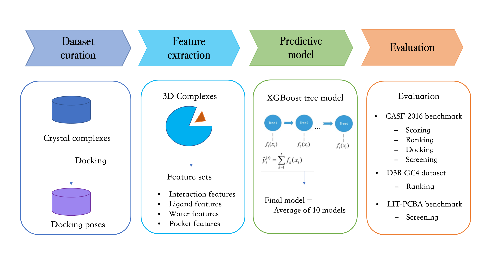

# delta_LinF9_XGB tutorial

*This is a delta machine-learning based protein-ligand scoring function*



### Setup

##### 1. Set the PATH for all softwares used in this work

In script/runXGB.py, you can modify the path based on your case.

All the softwares are available in delta_LinF9_XGB/software directory, except for MGLTools and MSMS.

(MGLTools can be downloaded at https://ccsb.scripps.edu/mgltools/downloads/)

```python
Vina = '/home/cyang/paper_XGB/delta_LinF9_XGB/software/smina_feature'
Smina = '/home/cyang/paper_XGB/delta_LinF9_XGB/software/smina.static'
SF = '/home/cyang/paper_XGB/delta_LinF9_XGB/software/sf_vina.txt'
ADT = '/home/cyang/MGLTools-1.5.6/MGLToolsPckgs/AutoDockTools/Utilities24/prepare_receptor4.py'
model_dir = '/home/cyang/paper_XGB/delta_LinF9_XGB/saved_model'
```

(MSMS can be downloaded at https://ccsb.scripps.edu/msms/downloads/)

```
cd {YourPATH}/delta_LinF9_XGB/software/
mkdir msms
tar -zxvf msms_i86_64Linux2_2.6.1.tar.gz -C msms
cd msms
cp msms.x86_64Linux2.2.6.1 msms
```

In msms folder, there is a script pdb_to_xyzr. Change the line numfile="./atmtypenumbers" to be numfile="YourPATH/delta_LinF9_XGB/software/atmtypenumbers". The updated atmtypenumbers file can be found in delta_LinF9_XGB/software directory.

In script/featureSASA.py, change the msmsdir="/home/cyang/paper_XGB/delta_LinF9_XGB/software/msms/" to msmsdir="{YourPath}/delta_LinF9_XGB/software/msms/"

##### 2. Required python packages

If encounter the error of python module not found, check if the below python packages have successfully installed. (try "pip install " or "conda install -c conda-forge ")

```
pandas==1.3.0
scipy==1.5.3
rdkit==2020.09.5
xgboost==1.2.0
openbabel==3.1.0
mdtraj
alphaspace2
```

AlphaSpace2 can be installed using the below commands:

```
cd software
tar -zxvf AlphaSpace2_2021.tar.gz
cd AlphaSpace2_2021
pip install -e ./
```


### **Run model**

*This is the re-scoring of crystal protein-ligand complexes or docked complexes.*

##### 1. Try examples with script/runXGB.py

In test directory, there are several prepared subdirectories (e.g. 1e66_dry, 1e66_wat) can be used as examples. 

For example, in test/1e66_wat subdirectory, there are two pdb files: 1e66_protein.pdb (receptor with water molecules) and 1e66_ligand.mol2 (ligand), as inputs to calculate the delta_LinF9_XGB score.

```shell
python script/runXGB.py test/1e66_wat/1e66_protein.pdb test/1e66_wat/1e66_ligand.mol2 | grep 'XGB'
```

The output can be:

```shell
XGB (in pK) :  8.893
```


##### 2. One jupyter notebook (script/__run_XGB_score.ipynb) is available to see the calculate of all features.


### References

1. Chao Yang and Yingkai Zhang. *J. Chem. Inf. Model.*, **62**, , (2022).

   [Delta Machine Learning to Improve Scoring-Ranking-Screening Performances of Protein–Ligand Scoring Functions.](http://dx.doi.org/10.1021/acs.jcim.2c00485)

2. Chao Yang and Yingkai Zhang. *J. Chem. Inf. Model.*, **61**, 4630 - 4644, (2021).

   [Lin_F9: A Linear Empirical Scoring Function for Protein–Ligand Docking.](http://dx.doi.org/10.1021/acs.jcim.1c00737)

3. Katigbak Joseph, Haotian Li, David Rooklin, and Yingkai Zhang. *J. Chem. Inf. Model.*, **61**, 4630 - 4644, (2021).

   [AlphaSpace 2.0: Representing Concave Biomolecular Surfaces Using β-Clusters.](https://doi.org/10.1021/acs.jcim.9b00652)

4. Lu Jianing, Xuben Hou, Cheng Wang, and Yingkai Zhang. *J. Chem. Inf. Model.*, **59**, 4540 - 4549, (2019).

   [Incorporating explicit water molecules and ligand conformation stability in machine-learning scoring functions.](https://doi.org/10.1021/acs.jcim.9b00645)

5. Wang Cheng and Yingkai Zhang. *J. Comput. Chem.*, **38**, 169 - 177, (2017). 

   [Improving scoring‐docking‐screening powers of protein–ligand scoring functions using random forest.](https://doi.org/10.1002/jcc.24667)

